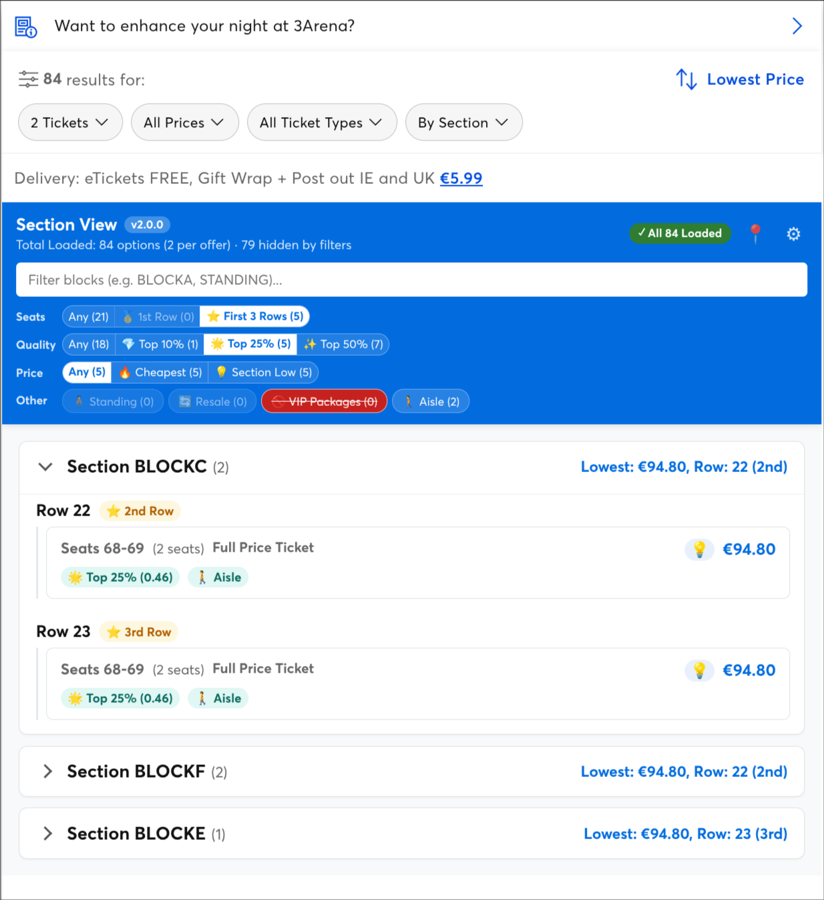

# Ticketmaster Section View

A Chrome / Brave extension that makes Ticketmaster's seat-selection list easier to scout. It regroups the tickets Ticketmaster shows you **by section and row**, with filters, badges, seat numbers and quality scores, and on venues with an interactive seat map it links the list and the map together, so the best options for you are easy to find.

> Unofficial and not affiliated with Ticketmaster. It can break whenever Ticketmaster changes its site. Built and tested against **ticketmaster.ie** (the seat map against The O2 Belfast); other Ticketmaster domains are in the manifest but untested.

<p align="center">
  
</p>

Above: the view in Ticketmaster's own ticket pane. The pills filter by seats, quality, price and extras (a red, struck-through pill is hiding those tickets); each section shows its lowest price and which row that is within its tier.

## What it does

- **Lists every ticket, grouped by section, then by row.** Each row shows its seats (`Seats 125-126 (2 seats)`), Ticketmaster's own ticket type, a quality badge (`💎 Top 10% (0.48)`), and the price with small badges for cheapest overall / best in its block / resale (with the markup on hover).
- **Reads Ticketmaster's own ticket-list request** instead of scrolling the page to load everything. It asks the way a person scrolling would (one page at a time, a moment apart), shows tickets as they arrive, and checks what it read against the cards on the page. If Ticketmaster refuses, or the two disagree, it falls back to scrolling. The status chip says which: `✓ All 311 Loaded (API)` or `(Scroll)`.
- **Filters**, each with a live count:
  - **Seats:** any, the 1st row of each tier, or the first N rows.
  - **Quality:** the best 10% / 25% / 50% of tickets by Ticketmaster's seat quality score.
  - **Price:** the cheapest ticket, or the cheapest in each section (worked out on whatever the other filters leave).
  - **Other:** Standing, Resale, VIP packages, and every attribute Ticketmaster reports (such as Aisle). Click a pill once to show only those tickets, again to **hide** them (so hiding Standing means "seated only"), a third time to clear it.
- **Your own badges.** Tag tickets whose text matches a pattern (a regular expression), globally or per venue.
- **Per-venue row settings.** Some venues don't start at Row 1 (3Arena, Dublin: the lower tier starts at Row 21, the upper at Row 33). Tell it where each tier starts (numbers or letters) so "1st row" and "First N rows" mean the right thing. Use the 📍 button in the header, or the options page.
- **Click a ticket to select it** on Ticketmaster's page, exactly as if you had clicked its own card.
- Shows **in place of Ticketmaster's list** (default, with a *By Section / Tickets* switch among its filter chips) or in a **floating pane** you can drag to resize.

## The venue's seat map

Where the page has Ticketmaster's interactive seat map (like The O2 Belfast's), the list and the map work together. Ticketmaster's own map is never altered: everything is drawn on top of it.

- **The map follows your filters.** Blocks with no ticket left after your filters are greyed, the way Ticketmaster greys its own unavailable blocks (a line in the header says how many). Zoomed in, the seats of tickets your filters leave out are greyed too.
- **Hover a section in the list:** its block is outlined on the map, and the map shows its own tooltip (the view photo and the price).
- **Rest on an open section:** the map opens it. A map that is zoomed in already zooms out first, then in at the new place.
- **Hover a ticket:** its seats are ringed on the zoomed map.
- **Hover a seat on the map:** its ticket lights up in the list (or its section, if that is closed), and clicking the seat opens the section. Hovering or clicking a block does the same for sections.
- **Prefer the map to stay put?** Untick **Auto zoom map** in the list's header. Every section and ticket then has a **Show on map** button instead, and a ticket's seats stay ringed until you show something else.
- **If a block looks wrong**, press **Map report** in the header. It labels every block on the map with what it is linked to for a few seconds (a red `?` is an available block no section matches) and copies a report you can send along.

The map and the list name blocks differently (the map says `NORTH MIDDLE 3`, the list `NTHM3`), so they are matched by name, by block id, and by how a code abbreviates a name. A block nothing matches is left alone unless every section has found its block.

## Install

There is no store listing yet, so load it unpacked:

1. Download this repo (**Code → Download ZIP**, then unzip it) or `git clone` it.
2. Open `chrome://extensions` (or `brave://extensions`, `edge://extensions`).
3. Switch on **Developer mode**.
4. Click **Load unpacked** and choose the folder that contains `manifest.json`.
5. Open a Ticketmaster seat-selection page and reload it.

Needs Chrome 111 or newer (Manifest V3). To update, pull or download again and press the reload icon on the extension's card.

If you also use the Tampermonkey userscript this extension grew out of, switch the userscript off or you'll get two panels.

## Turning it off

Right-click the toolbar icon (or use the ⋮ beside it in the browser's extensions menu) and untick **Enable Section View**. It takes effect at once, with no reload: Ticketmaster's list goes back exactly as Ticketmaster built it, and nothing is read or requested while it's off. The icon shows "off", and clicking it turns Section View back on. The same switch is on the settings page.

## Settings

Click the ⚙ in the view's header (or open the extension's options page) for:

- on or off;
- the seat map: link it to the list at all, and whether it zooms by itself (**Auto zoom map**, also in the list's header);
- where to show the view (in place of Ticketmaster's list, or a floating pane and which side) and its text size (compact / match Ticketmaster / comfortable);
- how tickets are loaded (Ticketmaster's list request, or scrolling);
- the default number of "front" rows, your custom badges, and each saved venue's settings.

## If something is off

- **The chip says `(Scroll)`.** Ticketmaster refused the direct read, or its data disagreed with the page, so the view fell back to scrolling. Hover the chip for the reason. After a refusal it leaves Ticketmaster's list API alone for 15 minutes.
- **A block on the seat map looks wrong.** Press **Map report** (see above).
- **More detail.** The extension logs to the browser console with the prefix `[Section View]`: what it read, what it could not match, and why.

## Privacy

- It asks for two permissions: **storage**, to remember your settings in your browser, and **contextMenus**, for the on/off item in the toolbar icon's menu. Neither can read any page.
- It runs only on Ticketmaster sites, reads the page you are on, and makes the same ticket-list requests the page itself makes, with your own browser session, one at a time and no faster than scrolling would. If Ticketmaster refuses them it stops. **Nothing is sent anywhere else.**

## Development

Plain ES modules, no build step.

```
npm install
npm test            # unit tests (vitest + jsdom)
```

To try changes, load the folder unpacked (see Install) and press the reload icon on the extension's card after each edit, then refresh the Ticketmaster tab.

## Licence

None chosen yet, so all rights are reserved by default. Ask before reusing.
